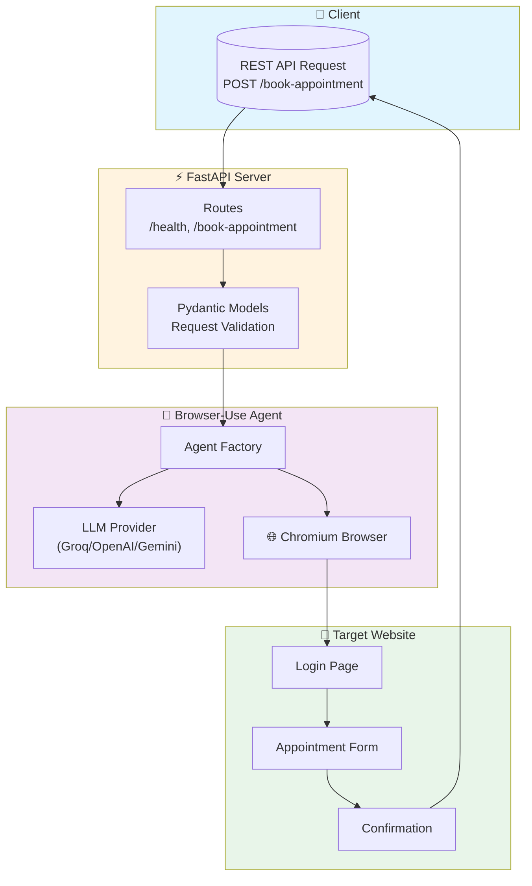
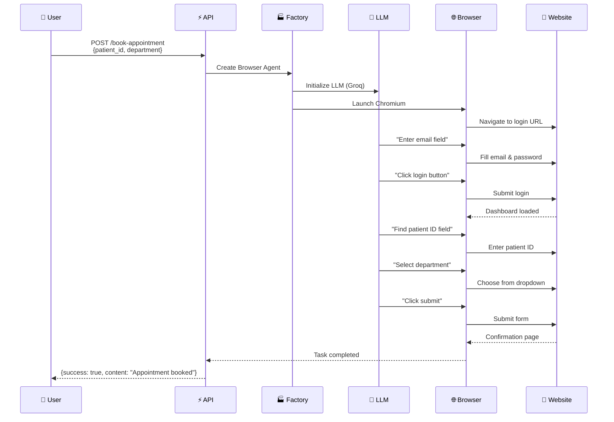

# 🤖 Appointment Coordination Agent

<p align="center">
  
</p>

<p align="center">
  <strong>AI-powered browser automation for website login and appointment scheduling</strong>
</p>

<p align="center">
  <a href="https://github.com/achuajays/Appointment-Coordination">
    
  </a>
  
  
  
</p>

---

## 📖 Overview

The **Appointment Coordination Agent** is an intelligent web automation system that uses AI to navigate websites, log in with credentials, and schedule appointments automatically. Built with [browser-use](https://github.com/browser-use/browser-use) and FastAPI.

---

## 🏗️ Architecture



---

## 🔄 How It Works



---

## ✨ Features

| Feature | Description |
|---------|-------------|
| 🔐 **Auto Login** | Automatically logs into websites with credentials |
| 📅 **Appointment Booking** | Fills forms and schedules appointments |
| 🧠 **AI-Powered** | Uses LLM to understand and navigate any website |
| 🚀 **REST API** | Simple FastAPI endpoints for integration |
| ⚙️ **Configurable** | All settings via environment variables |

---

## 📁 Project Structure

```
Appointment-Coordination/
├── main.py                 # FastAPI entry point
├── requirements.txt        # Dependencies
├── .env.example           # Environment template
├── assets/
│   └── banner.png         # Project banner
└── src/
    ├── config.py          # Configuration management
    ├── agent/
    │   ├── factory.py     # Agent creation
    │   └── instructions.py # System prompts
    └── api/
        ├── models.py      # Request/Response models
        └── routes.py      # API endpoints
```

---

## 🚀 Quick Start

### 1. Clone & Install

```bash
git clone https://github.com/achuajays/Appointment-Coordination.git
cd Appointment-Coordination

# Create virtual environment
pip install uv
uv venv --python 3.12
.venv\Scripts\activate  # Windows

# Install dependencies
uv pip install -r requirements.txt
uvx browser-use install
```

### 2. Configure Environment

```bash
copy .env.example .env
```

Edit `.env` with your settings:
```env
GROQ_API_KEY=your_groq_api_key
GROQ_MODEL=meta-llama/llama-4-scout-17b-16e-instruct
WEBSITE_URL=https://your-appointment-site.com/login
LOGIN_EMAIL=your_email@example.com
LOGIN_PASSWORD=your_password
```

### 3. Run the Server

```bash
python main.py
```

Server available at: **http://localhost:8000**

---

## 📚 API Endpoints

| Method | Endpoint | Description |
|--------|----------|-------------|
| GET | `/health` | Health check |
| POST | `/book-appointment` | Book an appointment |

### Example Request

```bash
curl -X POST http://localhost:8000/book-appointment \
  -H "Content-Type: application/json" \
  -d '{
    "patient_id": "PAT-12345",
    "department": "Cardiology"
  }'
```

### Example Response

```json
{
  "success": true,
  "content": "Successfully logged in and submitted appointment for patient PAT-12345 in Cardiology department.",
  "error": null
}
```

---

## ⚙️ Configuration

| Variable | Description | Required |
|----------|-------------|----------|
| `GROQ_API_KEY` | Groq API key for LLM | ✅ |
| `GROQ_MODEL` | Model ID (must support vision) | ✅ |
| `WEBSITE_URL` | Target website login URL | ✅ |
| `LOGIN_EMAIL` | Login email/username | ✅ |
| `LOGIN_PASSWORD` | Login password | ✅ |
| `DEBUG_MODE` | Enable debug logging | ❌ |
| `HEADLESS_MODE` | Run browser headless | ❌ |

---

## 🔒 Security Notes

> ⚠️ **Important**: Never commit `.env` files with real credentials to version control.

- Credentials are stored in environment variables only
- For production, use secure credential management
- Configure CORS appropriately for your deployment

---

## 📄 License

MIT License

---

<p align="center">
  Built with ❤️ using <a href="https://github.com/browser-use/browser-use">browser-use</a> and <a href="https://fastapi.tiangolo.com/">FastAPI</a>
</p>
